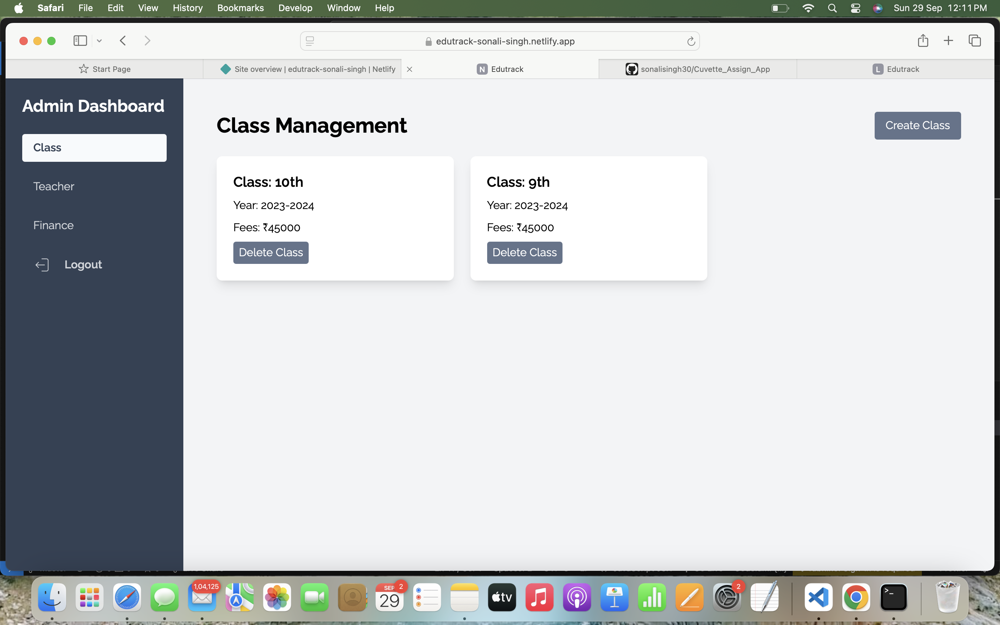
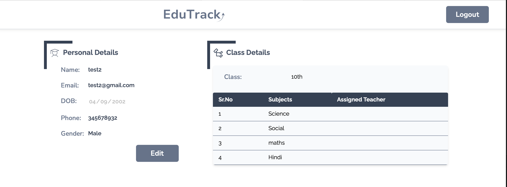
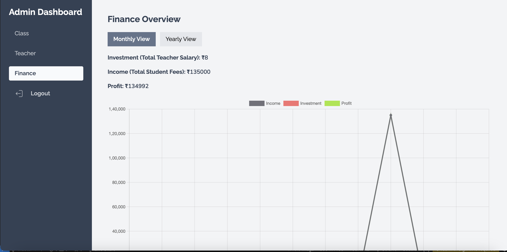
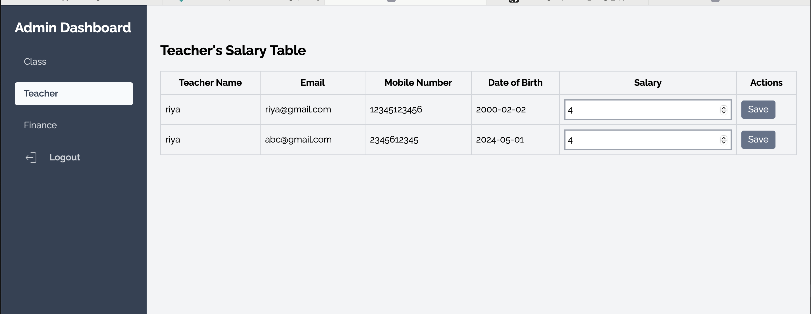

# School Management App

A comprehensive school management application designed to simplify administrative and academic management tasks. The app includes features for class management, teacher management, and finance tracking, with separate dashboards for admins and users.

[Live Demo](https://edutrack-sonali-singh.netlify.app)



## Features
- **User Authentication**: Secure signup and signin.
- **Admin Dashboard**: Manage classes, teachers, and finances.
- **User Dashboard**: Personalized dashboard for users.
- **Responsive Design**: Optimized for desktop and mobile.
- **Toast Notifications**: Real-time feedback for user actions.
  
## Technologies Used
- **Frontend**: React, Tailwind CSS, Vite, Redux
- **State Management**: Redux Toolkit
- **Routing**: React Router
- **Form Handling**: react-hook-form
- **Notifications**: react-hot-toast
- **Charts**: Chart.js, react-chartjs-2

## Installation

1. Clone the repository:
   ```bash
   git clone https://github.com/sonalisingh30/Cuvette_Assign_App.git
   cd Cuvette_Assign_App
   ```

2. Install the dependencies:
   ```bash
   npm install
   ```

3. Start the development server:
   ```bash
   npm run dev
   ```

## Deployment

The app is deployed on Netlify. Check it out here: [Live Demo](https://edutrack-sonali-singh.netlify.app)

## Screenshots

### Sign Up Page


### Sign In Page


### Admin Dashboard


### Student Personal Details Page


### Finance Page


### Teacher's Salary Page


## Folder Structure
The project follows a structured format:

```bash
src
├── components
│   ├── ClassModal.jsx
│   ├── ClassTable.jsx
│   ├── Sidebar.jsx
│   ├── StudentTable.jsx
│   ├── TeacherClassaTable.jsx
│   ├── TeacherTable.jsx
├── data
│   ├── fileImports.js
├── hooks
│   ├── useDeviceWidth.jsx
│   ├── useGenerateUniqueKey.jsx
│   ├── useRouter.jsx
├── pages
│   ├── AdminDashboardLayout.jsx
│   ├── ClassPage.jsx
│   ├── DashboardLayout.jsx
│   ├── FinancePage.jsx
│   ├── Profile.jsx
│   ├── ProtectedRoute.jsx
│   ├── SignIn.jsx
│   ├── SignUp.jsx
│   ├── StudentPage.jsx
│   ├── TeacherPage.jsx
├── slices
│   ├── classSlice.jsx
└── utils
```

## Contributing

Feel free to open a pull request or issue for suggestions, bug reports, or new features.

## Contact

For any queries or issues, reach out to me at:  
**Gmail**: sonalisingh30112001@gmail.com  
**GitHub**: [sonalisingh30](https://github.com/sonalisingh30)
